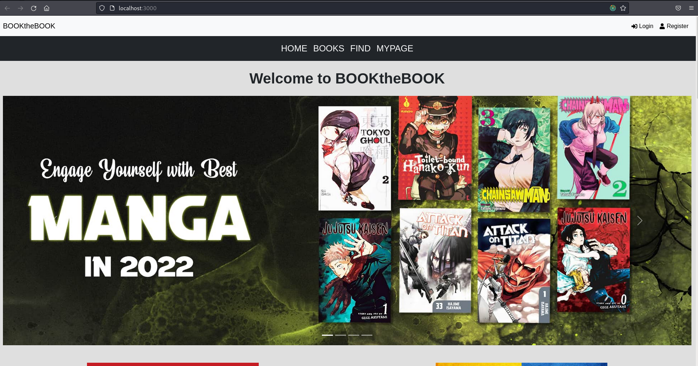
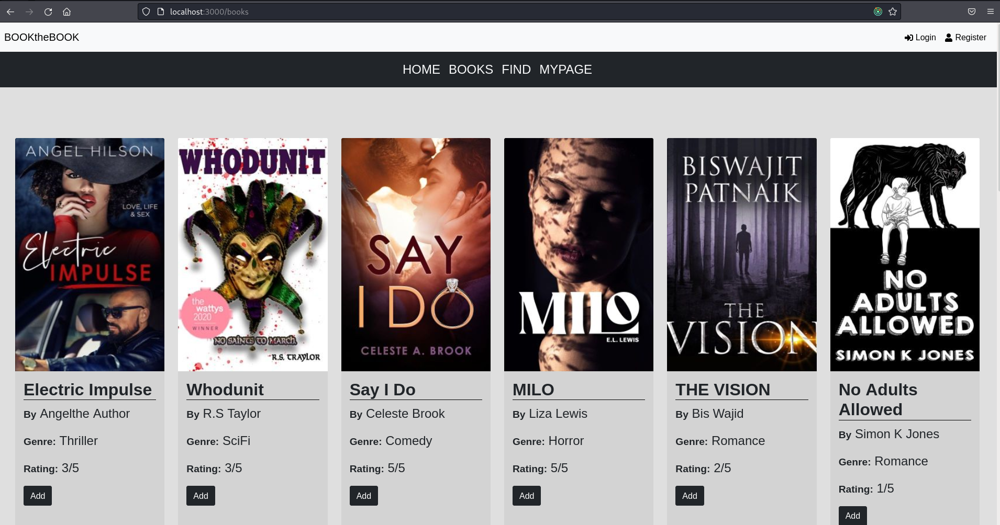
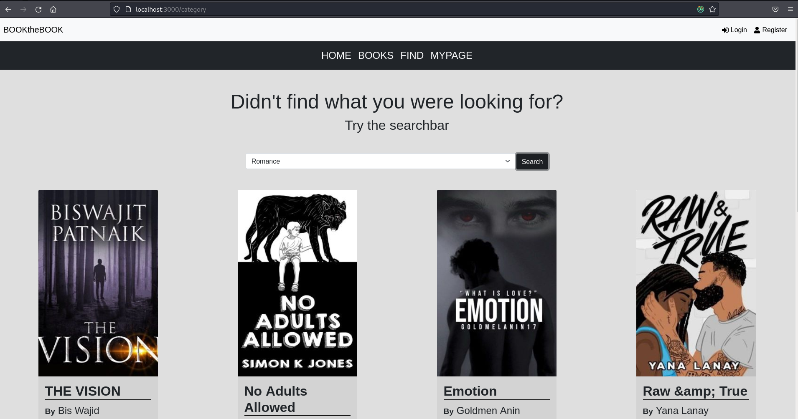
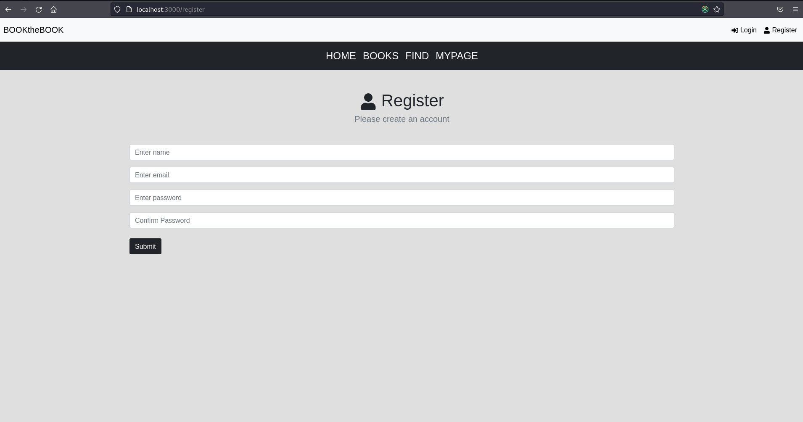

# BOOKtheBOOK MERN Stack Project #
A bookstore app that has the following features:
- Vibrant UI
- Registration and Login
- View Books
- Search books based on category
- Add Books to personal

## Contents in this readme ##
- Webpage Screenshots
- Instructions to run program
- Note/Disclaimer
- Technologies used

## Webpage Screenshots ##
<h3>Homepage</h3>

<h3>Bookspage</h3>

<h3>Book Search Page</h3>

<h3>Login Page</h3>

<h3>Registration Page</h3>

## Instructions ##
- In the **root directory** run `npm install` (this is to install dependencies for backend)
- In the **frontend directory** run `npm install` (this is to install dependencies for frontend)
- Go back to the **root directory** and run `npm run dev` to launch

## Note: ##
- Contains both Frontend and Backend
- .env file included temporarily

## Technologies used ##
- HTML, CSS, JS
- React JS (includes redux)
- Node JS
- MongoDB
- Express
